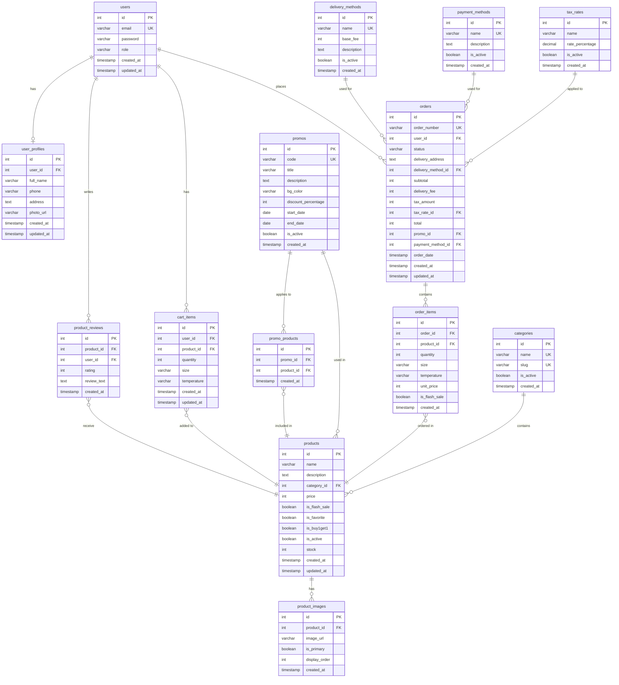

```mermaid
erDiagram
    users {
        int id PK
        varchar email UK
        varchar password
        varchar role
        timestamp created_at
        timestamp updated_at
    }
    
    user_profiles {
        int id PK
        int user_id FK
        varchar full_name
        varchar phone
        text address
        varchar photo_url
        timestamp created_at
        timestamp updated_at
    }
    
    categories {
        int id PK
        varchar name UK
        varchar slug UK
        boolean is_active
        timestamp created_at
    }
    
    products {
        int id PK
        varchar name
        text description
        int category_id FK
        int price
        boolean is_flash_sale
        boolean is_favorite
        boolean is_buy1get1
        boolean is_active
        int stock
        timestamp created_at
        timestamp updated_at
    }
    
    product_images {
        int id PK
        int product_id FK
        varchar image_url
        boolean is_primary
        int display_order
        timestamp created_at
    }
    
    product_reviews {
        int id PK
        int product_id FK
        int user_id FK
        int rating
        text review_text
        timestamp created_at
    }
    
    promos {
        int id PK
        varchar code UK
        varchar title
        text description
        varchar bg_color
        int discount_percentage
        date start_date
        date end_date
        boolean is_active
        timestamp created_at
    }
    
    promo_products {
        int id PK
        int promo_id FK
        int product_id FK
        timestamp created_at
    }
    
    delivery_methods {
        int id PK
        varchar name UK
        int base_fee
        text description
        boolean is_active
        timestamp created_at
    }
    
    payment_methods {
        int id PK
        varchar name UK
        text description
        boolean is_active
        timestamp created_at
    }
    
    tax_rates {
        int id PK
        varchar name
        decimal rate_percentage
        boolean is_active
        timestamp created_at
    }
    
    orders {
        int id PK
        varchar order_number UK
        int user_id FK
        varchar status
        text delivery_address
        int delivery_method_id FK
        int subtotal
        int delivery_fee
        int tax_amount
        int tax_rate_id FK
        int total
        int promo_id FK
        int payment_method_id FK
        timestamp order_date
        timestamp created_at
        timestamp updated_at
    }
    
    order_items {
        int id PK
        int order_id FK
        int product_id FK
        int quantity
        varchar size
        varchar temperature
        int unit_price
        boolean is_flash_sale
        timestamp created_at
    }
    
    cart_items {
        int id PK
        int user_id FK
        int product_id FK
        int quantity
        varchar size
        varchar temperature
        timestamp created_at
        timestamp updated_at
    }

    users ||--o{ cart_items : "has"
    users ||--o{ orders : "places"
    users ||--o| user_profiles : "has"
    users ||--o{ product_reviews : "writes"
    product_reviews }o--|| products : "receive"
    products ||--o{ product_images : "has"
    promos ||--o{ promo_products : "applies to"
    cart_items }o--|| products : "added to"
    promo_products }o--|| products : "included in"
    promos ||--o{ products : "used in"
    order_items }o--|| products : "ordered in"
    orders ||--o{ order_items : "contains"
    delivery_methods ||--o{ orders : "used for"
    payment_methods ||--o{ orders : "used for"
    tax_rates ||--o{ orders : "applied to"
    categories ||--o{ products : "contains"
```
    
    
    